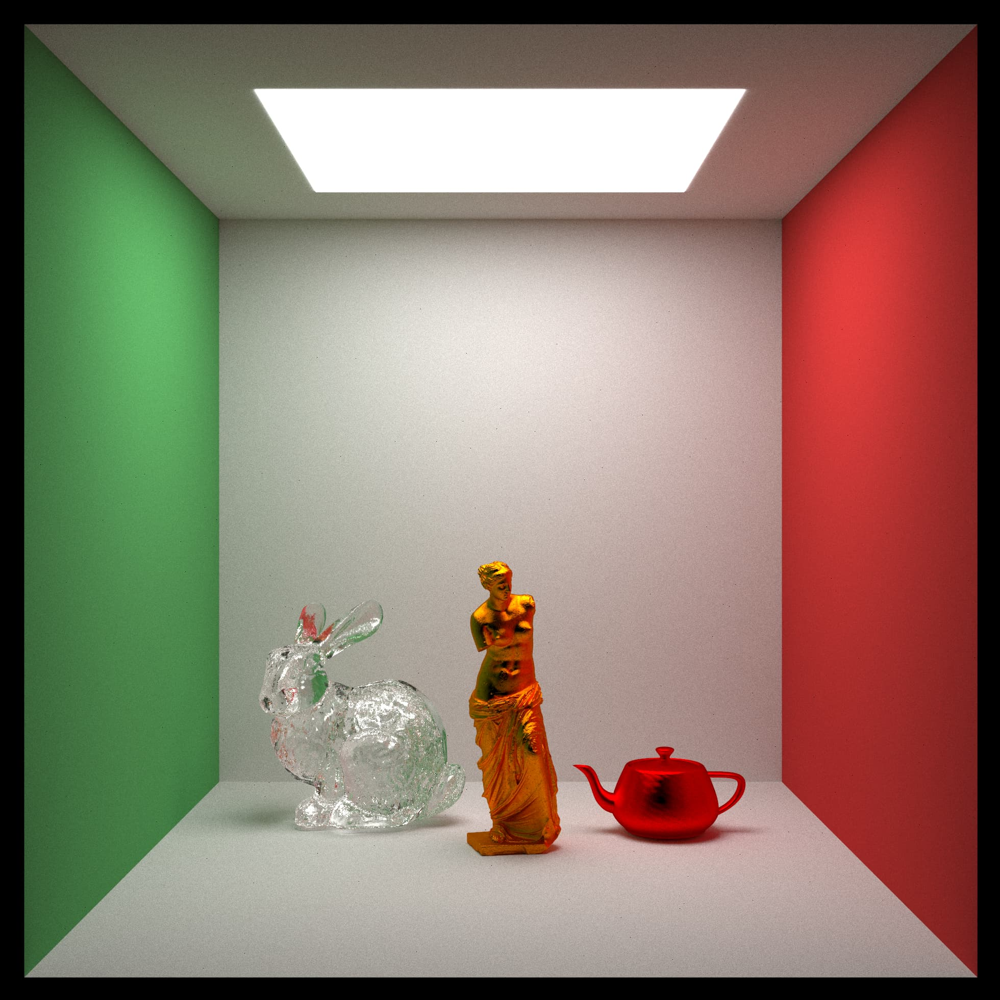

 # Ray Tracer - Computer Graphics Project
  
### Introduction
This project is a simple ray tracer that uses the CPU to render images. But, trying to make it parallel using TBB from Intel and the BVH from Embree to improve the performance of the ray tracer.

### Project goal
The objective of this project is know the basics of ray tracing and how to implement it. Also, make customizable the scene and the camera to render different images. It supports mesh files OBJ and MTL, materials and textures.
All of this in C++.

### Scene configuration
The scene is configured in a JSON file, where you can set the camera, the lights, the objects and the materials.

```json
{
  "mode": 1,
  "camera": {
    // CAMERA SETTINGS
  },
  "textures": [
    {
      "image": {
        "path": "path/to/image.png"
      }
    },
    {
      "checker": {
        "scale": 0.32,
        "even": <<Color>>,
        "odd": <<Color>>
      }
    }
  ],
  "materials": [
    {
      "type": "diffuse_light" | "lambertian" | "metal" | "dielectric",
      "texture": <<textureId>>
    }
  ],
  "objects": [
    {
      "type": "sphere",
      "center": <<Point>>,
      "radius": 100,
      "material": <<materialId>>
    },
    {
      "type": "mesh",
      "path": "path/to/mesh.obj",
      "center": <<Point>>,
      "scale": 1,
    }
  ],
  "output": "path/to/output.png"
}
```

#### Mode
The mode is an integer that represents the type of render that you want to do. The possible values are:
- 0: Show the scene in a window.
- 1: Render the scen with simple sampler.
- 2: Render the scene with a stratified sampler.

#### Camera settings
The camera settings are:
- samples: The number of samples that the camera will take.
- depth: The depth of the recursion of the rays.
- width: The width of the image.
- lookfrom: The position of the camera.
- lookat: The point where the camera is looking.
- background: Color of the background.
```json
// CAMERA SETTINGS
"camera": {
  "samples": 100,
  "depth": 50,
  "width": 800,
  "lookfrom": {
    "x": 0,
    "y": 0,
    "z": 0
  },
  "lookat": {
    "x": 0,
    "y": 0,
    "z": -1
  },
  "background": {
    "x": 0.7,
    "y": 0.8,
    "z": 1
  }
}
```

# Integrantes
<table>
 <tr>
   <td>
     
     <br/>
     <a href="https://github.com/Lchahuas">Luis Chahua</a>
   </td>
   <td>
     
     <br/>
     <a href="https://github.com/nicolas-castaneda">Nicolas Castañeda</a>
   </td>
   <td>
     
     <br/>
     <a href="https://github.com/juaquin456">Juaquín Remon</a>
    <td>
     
     <br/>
     <a href="https://github.com/artrivas">Dimael Rivas</a>
   </td>
 </tr>
</table>


